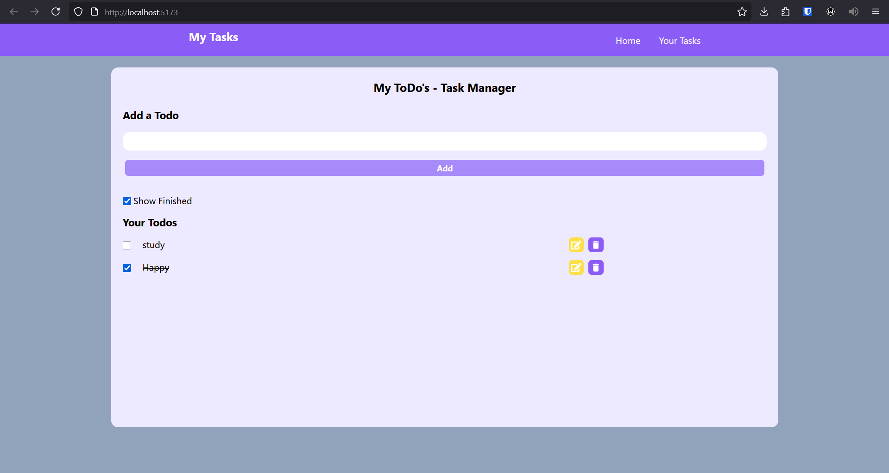

# ✅ My ToDo List W — Task Management App

A minimal and responsive **To-Do List** built with **React**, styled using **TailwindCSS**, and bootstrapped with **Vite** for lightning-fast development. This project demonstrates modern React patterns, persistent client-side state with localStorage, and clean, accessible UI design.

---

## 📌 Features

- ✍️ **Add, Edit, Delete Tasks**  
  Full CRUD functionality to manage daily tasks.

- ✅ **Mark Tasks as Completed**  
  Visually differentiate completed vs pending tasks.

- 🗂️ **Filter by Status**  
  Toggle visibility of all, active, or completed tasks.

- 💾 **Persistent Local Storage**  
  Saves your tasks in the browser – no backend required.

- 🎨 **Utility-First Styling with TailwindCSS**  
  Clean and modern UI with mobile responsiveness out of the box.

- ⚡ **Powered by Vite**  
  Ultra-fast development build tool for React.

---

## 🛠️ Tech Stack

- **React.js (Hooks, Components)**
- **Vite** – Next-gen frontend tooling
- **TailwindCSS** – Utility-first styling
- **localStorage API** – Client-side data persistence

---

## 🖥️ Screenshots

> _Include screenshots to showcase the app UI_  

  

---

💡 Learning Highlights

This project helped me:

    Solidify understanding of React hooks and component state

    Use localStorage to persist data across sessions

    Design with utility-first CSS (Tailwind)

    Optimize project structure using Vite

🧠 Future Enhancements

    🌓 Dark mode toggle

    📝 Task due dates & priority levels

    🔄 Undo/redo functionality

    ☁️ Backend integration for cross-device sync

    🧪 Unit testing with React Testing Library or Vitest

🙋‍♂️ About Me

I'm an aspiring full-stack developer focused on building interactive, responsive, and user-friendly applications. This project is part of my growing portfolio in preparation for 2025 placement opportunities.

Connect with me on LinkedIn or check out more projects on GitHub.
⭐️ Show Your Support

If you found this project useful, please ⭐ the repository. Feedback and pull requests are welcome!
